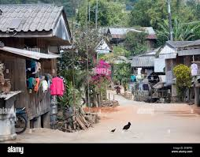

# my-summer-in-markdown
## Introduction
Hi my name is **Maya Kim**. I am in 11th grade and I previously took AP Computer Science Principles in 9th grade. 

## Sumer Activities
This summer I went on many fun trips, including going to a <u>summer camp, a thailand missions trip, and a family trip to Alaska.</u> 

## Goals for the School Year
In this class I hope to learn more about Computer Science, as well as **earn an A** and hopefully **pass the AP test** in May. Overall, this school year I want to be able to stay on task in my classes, and not procrastinate my work. 

## Summer Playlist
Over summer I listened to:

- *Sabrina Carpenter*
- *Gable Price and Friends*
- *Zach Bryan*

## Most Memorable Experience
Some of my favorite summer memories were in Thailand. It was a very special trip and I will never forget it. We went to villages and schools, helping kids stay safe. 

